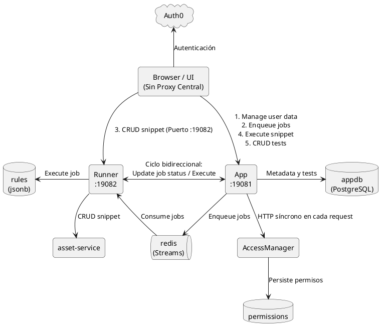
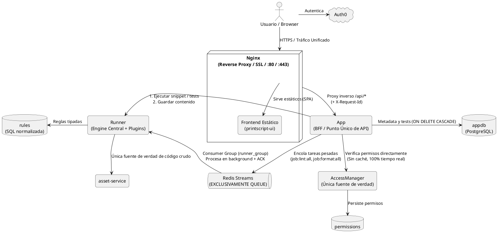
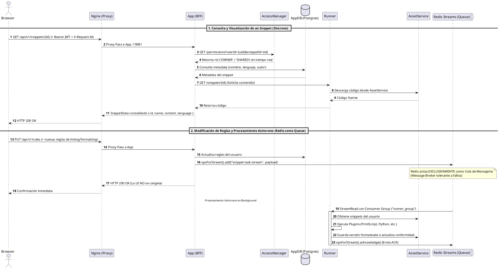

# COMPARATIVA DE ARQUITECTURAS: FLUJO DE UN SNIPPET

Este documento explica de forma clara, técnica y gráfica cómo operaba el flujo de un snippet en la **arquitectura anterior (vieja)**, cómo funciona en la **arquitectura optimizada (nueva)** incorporando **Nginx como Reverse Proxy** y utilizando **Redis EXCLUSIVAMENTE como Cola de Mensajería (Streams / Message Queue)**, y **por qué la nueva arquitectura es sustancialmente superior**.

---

## 1. El Flujo de un Snippet con la Arquitectura Vieja

En la arquitectura anterior, el frontend (React) actuaba indebidamente como **orquestador de infraestructura** y los microservicios sufrían de **acoplamiento bidireccional y dependencias circulares**.

### Diagrama PlantUML (Arquitectura Vieja)

### ¿Qué ocurría paso a paso en la Arquitectura Vieja?

1. **La UI como orquestador (Falta de Reverse Proxy y BFF)**:
   - El cliente web debía conocer y conectarse a **dos puertos distintos directamente** (`:19081` para `App` y `:19082` para `Runner`), exponiendo la topología interna a internet.
   - Para abrir un snippet, la UI disparaba **dos llamadas HTTP desarticuladas en paralelo**:
     - Llamada 1 a `App` para obtener metadata.
     - Llamada 2 a `Runner` para obtener el contenido.
2. **Dependencia Circular entre microservicios**:
   - `App` llamaba a `Runner` para ejecutar snippets y correr tests, pero al crear un snippet, `Runner` llamaba de regreso a `App` (`appClient.registerSnippet`). Esto generaba un ciclo de dependencia peligroso.
3. **Chatty HTTP en Autorización**:
   - En cada petición del usuario, `App` realizaba una llamada HTTP síncrona a `AccessManager`, sumando latencia y creando un punto único de fallo.
4. **El "Teléfono Descompuesto" en Baterías de Tests**:
   - Al ejecutar una batería de tests sobre un snippet, `Runner` no conservaba el asset y volvía a descargarlo desde `AssetService` por HTTP para cada caso de prueba, multiplicando el tráfico innecesariamente.
5. **Trazabilidad Fragmentada en New Relic**:
   - Al dividirse la comunicación desde el browser a distintos puertos, las trazas de New Relic aparecían en árboles desconectados.

---

## 2. El Flujo de un Snippet con la Arquitectura Nueva

La arquitectura nueva introduce **Nginx como Reverse Proxy / API Gateway**, centraliza el flujo en **App (BFF)** y reserva **Redis EXCLUSIVAMENTE como Cola de Mensajería Asíncrona (Queue)** para tareas pesadas y tolerantes a fallos (User Stories #12 y #15).

### Diagrama PlantUML (Arquitectura Nueva Optimizada)

### Diagrama de Secuencia: Flujo Paso a Paso a través de Nginx y los Servicios

---

## 3. ¿Por Qué Redis EXCLUSIVAMENTE como Cola y NO como Caché?

La decisión de no utilizar Redis como caché y restringirlo estrictamente a **Cola de Mensajería (Message Broker / Streams)** se fundamenta en principios sólidos de ingeniería:

1. **Principio de Responsabilidad Única (SRP) en la Infraestructura**:
   - Redis tiene un propósito nítido y sin ambigüedades: **transporte y buffer asíncrono de eventos (Event-Driven Architecture)**.
   - No se mezcla la gestión de estado de sesiones/permisos con la cola de procesamiento en background.
2. **Consistencia Inmediata y Cero Datos Obsoletos (Zero Stale Data)**:
   - El caching de permisos introduce el clásico problema de *Cache Invalidation*. Si un usuario revoca el acceso a un colaborador pero la caché tiene un TTL de 5 minutos, el colaborador podría seguir leyendo código privado durante ese tiempo.
   - Sin caché en Redis, **`AccessManager` es siempre la única fuente de verdad en tiempo real**. Un permiso revocado tiene efecto en el milisegundo cero.
3. **`AssetService` como Única Fuente de Verdad para Código**:
   - El código fuente no se duplica en memoria intermedia; reside de forma fidedigna y versionada en el almacenamiento de blobs (`AssetService`).
4. **Tolerancia a Fallos Robusta (User Stories #12 y #15)**:
   - Gracias a las capacidades de **Redis Streams** (`XADD`, `XREADGROUP`, `XACK`), si un Runner se reinicia durante una tarea de linteo masivo de 500 snippets, el mensaje permanece en la lista de pendientes (PEL - Pending Entries List) y es retomado automáticamente sin pérdida de trabajo.

---

## 4. El Rol Crítico de Nginx como Reverse Proxy

En la arquitectura vieja, el cliente web debía conocer IPs y puertos internos (`19081`, `19082`). En la nueva arquitectura, **Nginx es el único punto de contacto exterior**:

1. **Seguridad y Ocultamiento de Red (Network DMZ)**:
   - Los microservicios (`App`, `Runner`, `AccessManager`, Postgres, Redis, AssetService) corren en una red interna privada de Docker (`bridge` interna).
   - Ningún microservicio backend expone puertos directamente al mundo exterior; todo el tráfico pasa obligatoriamente por Nginx.
2. **Terminación SSL / TLS**:
   - Nginx se encarga del cifrado HTTPS (puerto 443) y certificados de dominio (ej. DuckDNS), liberando a Spring Boot y Node.js del cómputo criptográfico.
3. **Enrutamiento por Prefijo de Ruta (Path-Based Routing)**:
   - `https://midominio.com/` $\rightarrow$ Sirve la SPA compilada de React (`printscript-ui`).
   - `https://midominio.com/api/*` $\rightarrow$ Redirige internamente a `App` (`http://app:19081`).
4. **Inyección y Preservación de Trazabilidad (`X-Request-Id`)**:
   - Nginx puede generar o reenviar el encabezado `X-Request-Id` hacia `App`, garantizando que cada petición quede correlacionada en los logs y en New Relic desde el borde de la red.

---

## 5. Tabla Comparativa Definitiva

| Componente / Dimensión | Arquitectura Vieja | Arquitectura Nueva (Actual) | Justificación Técnica |
| :--- | :--- | :--- | :--- |
| **Punto de Entrada Exterior** | Sin proxy. Browser expuesto a puertos `:19081` y `:19082`. | **Nginx (Reverse Proxy)** en puertos `:80` / `:443`. | **Seguridad & DMZ**: Oculta puertos internos, enruta `/api` a App y sirve la UI estática. |
| **Punto de Entrada API** | Fragmentado: llamadas directas a `App` y a `Runner`. | **BFF Unificado en `App`**: La UI solo habla con `App`. | **Bajo Acoplamiento**: Cambios internos de red no impactan en el cliente web. |
| **Rol de Redis** | Sin rol claro o mezclado. | **EXCLUSIVAMENTE Message Queue (Streams)**. | **Event-Driven puro**: Procesa tareas pesadas (US #12 y #15) con Consumer Groups y ACKs. |
| **Políticas de Autorización** | Chatty HTTP con posible desincronización. | Consulta directa a `AccessManager` (Sin caché). | **Consistencia Inmediata**: Cero bugs de *stale permissions*; única fuente de verdad. |
| **Gestión de Código Fuente** | Llamadas cruzadas desordenadas. | `AssetService` como repositorio central estricto. | **Integridad de Assets**: Código siempre sincronizado y respaldado. |
| **Extensibilidad de Lenguajes** | PrintScript hardcodeado en Runner. | **Engine Central + Plugins** (`LanguageRunner`). | **Open/Closed Principle**: Nuevos lenguajes (Go, Python) se enchufan sin tocar el pipeline. |
| **Modelo de Base de Datos** | Antipatrón `jsonb` y `text[]` no tipados. | Tablas normalizadas (`test_cases`, `test_inputs`, etc.). | **Integridad Referencial**: Claves foráneas con `ON DELETE CASCADE`. |
| **Monitoreo & Observabilidad** | Trazas fragmentadas e inconexas. | Traza unificada `X-Request-Id` desde Nginx hasta AssetService. | **New Relic Full Tracing**: Un solo árbol de transacción para toda la petición. |
